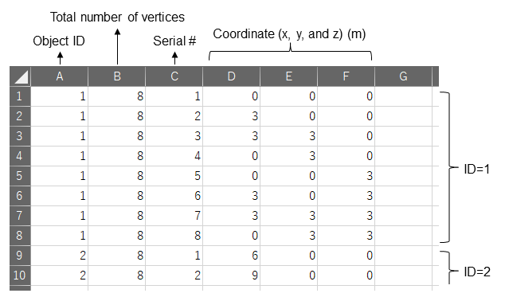

# Large Outdoor Fire Dynamics
This is an accompanying Python code of the following book:
Himoto K. "Large outdoor fire dynamics", CRC Press, 2022.
https://x.gd/WCS1v
The code implements a physics-based simulation of fire spread between discretely distributed 3D fuel objects in outdoor fires. The code has been tested with Python 3.10.4 and NumPy 1.22.3. 

# Setup
The code set contains a folder (data), nine Python files (cgprm.py, fire.py, g.py, gprm.py, init.py, main.py, ndat.py, rndm.py, and sprd.py ), and two bat files (exec.bat and setup.bat).
Run "setup.bat" for setting up an execution environment on your PC. 
This installs libraries required for running the code and creates two new folders (pycache and venv) in the working folder. 

# Input
Simulation condition is specified in three CSV fires in "data" folder, "o.csv", "v.csv", and "p.csv".

## o.csv
The first line comprises two integers that represent the overall combustible space. The first and second items are the total number of fuel objects and the ID of the fire origin, respectively.
The second line is a real number representing the ambient temperature in (K).
The third line comprises three real numbers on the ambient wind condition. The first item is the wind velocity in (m∙s^(-1)). 
The second and third items are the x- and y- components of the unit wind vector, respectively. 
For simplicity, we did not assume a change in the wind condition during the simulation. 
The fourth and subsequent lines comprise data on individual fuel objects. The first and second items on each line are the object ID and weight (kg), respectively.
The other object-related data is automatically calculated from the data specified in “v.csv” and “p.csv”.

## v.csv
“v.csv” specifies the coordinates of one vertex per line. 
The first through third items are the object ID, the number of vertices composing the object, and the serial number per object, respectively. 
The fourth through sixth items are the x-, y-, and z-coordinates, respectively. 
Although the sequence of vertices matters when defining face polygons in "p.csv", "v.csv" only defines the vertex coordinates. 
Thus, there is no particular rule for their sequence. 
However, in the sample data, the four vertices on the bottom of the cube came first, followed by the four vertices on the top. 
The four vertices on each horizontal face were aligned counterclockwise when the wood crib was viewed from above.

## p.csv
"p.csv" specifies data on one face polygon per line. 
Each line comprises eight numbers. 
The first through third items are the object ID, the total number of face polygons that compose the object, and the serial number of the face polygon per object, respectively. 
The fourth item is an identifier that takes “0” when the face polygon is the bottom face and “1” otherwise. 
This identifier determines whether the face polygon could be subject to external heating. 
The fifth through eighth items are the four component vertices of the face polygon.
The vertex IDs in “p.csv” correspond to the serial numbers defined in “v.csv”. 
In contrast to “v.csv”, the sequence of the four vertex IDs is meaningful. 
When the face polygon was viewed from the outside, the vertices were aligned counterclockwise. 
In this way, the normal vectors of each face polygon required for judging the visibility from the other face polygons can be calculated systematically. 
The only exception was the bottom face, where the vertices were aligned clockwise when viewed from the outside. 
This is because the ground was not defined as a separate polygon in this case study. 
It is noteworthy that although the number of vertices composing the face polygon in the sample data was four, an arbitrary number of vertices can be defined in the present simulation model. 

# Execution 
Run "exec.bat" to perform the fire spread simulation as per conditions set in CSV files in "data" folder. 
The simulation results are saved as KML and CSV files in the "data" folder. 
Running a KML file launches Google Earth, visualizing the burn state of fuel objects at a specified time interval. 
The results of fire spread simulation, including the time evolution of the number of burning and burnt fuel objects, are saved in separate CSV files. 

# License
MIT
